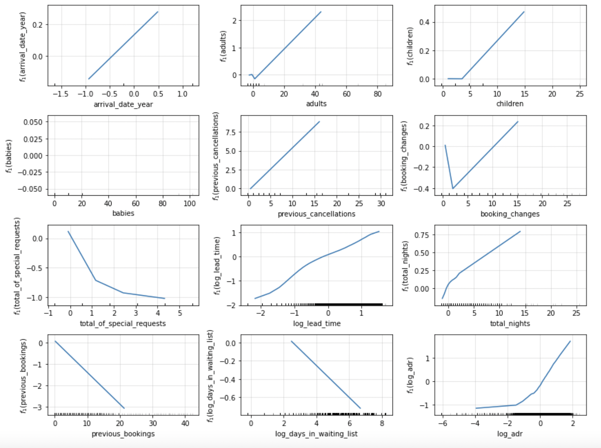

```{r setup, include=FALSE}
knitr::opts_chunk$set(echo = TRUE, warning = FALSE, message = FALSE)
```

# Introduction 

Smith Travel Research estimates there are 17.5 million guestrooms in 187,000 hotels worldwide. In 2020, global hotel revenue was $198.6 billion dollars, and the hotel and tourism industry accounts for approximately 10\% of worldwide GDP [@hoteltechreport]. The hotel industry experiences approximately 24\% of cancellations on reservations, and this rate increases up to 38\% for online bookings [@mkttips]. With this figures, and specially after the Covid-19 Pandemic, the study of hotel booking cancellations has become more relevant.

Accurately forecasting hotel booking cancellations and understanding the factors that influence such behavior is relevant for the following XXX reasons. First, from an economic perspective, each unoccupied room results in an economic loss for the hotel. If accurately and timely forecasted, the hotel could still allocate the room to a different customer and avoid loosing revenue. Additionally, this would help the hotel to understand their net demand. Second, from the operational side of the business, managing cancellations is costly both in time and resources. For example, during peak seasons the hotel might need to allocate additional resources to manage cancellations and to try to reallocate the rooms. An accurate forecast could help to reduce operational costs and improve the hotel's efficiency. Third, from a marketing perspective, forecasting booking cancellations opens the possibility to implement pricing strategies, such as offering discounts to retain the customer.

Hotel booking cancellations and revenue management has been widely studied in the literature. [@antonio2019big] use data from eight hotels combined with additional sources (such as weather or holidays) to develop booking cancellation prediction models to help hoteliers understand their net demand and improve their revenue management. [@chen2011search] use a multinomial logit regression to analyze the impact of cancellation fees and deadlines on hotel bookings and find that the former affects customer's behavior but the later doesn't. [@falk2018modelling] uses data of 9 hotels to estimate a probit model with cluster adjusted standard errors at the hotel level to find the determinants of cancellation probability, among which booking lead time and country of residence are the most important. [@sanchez2020using] apply ML algorithms to forecast hotel booking cancellations using genetic algorithms to configure the structural parameters of the artificial neural network used.

In this regard, we contribute to the study of hotel booking cancellations by analyzing the \textit{Hotel booking demand} data set available in [Kagle](https://www.kaggle.com/datasets/jessemostipak/hotel-booking-demand)^[Data set retrieve on January 18th 2023 at https://www.kaggle.com/datasets/jessemostipak/hotel-booking-demand.] with the aim of forecasting hotel booking cancellations through the lens of Machine Learning (ML) models. This data set contains 19,390 booking registries of a resort hotel and a city hotel from a chain in Portugal and includes 32 predictors such as date of the booking, length of stay, number of children and adults, type of meal, number of special requests, among others. To forecast cancellations, we first do an exploratory data analysis to understand the data set and the relations between the predictors and the response. Then we clean the data, select the main features and apply some transformations, as well as create new features. Then we fit several ML classification models to the final data set. For this process, we randomly split the data in training (\textcolor{red}{XXX} observations) and test (\textcolor{red}{XXXX} observations). Specifically, we estimate a Naive Bayes classifier (benchmark), Logistic Regression, Neural Network, Tree, k-Nearest Neighboors, Local Logistic Regression, Weighted Kernel, Boosting, Random Forest and Support Vector Machines. For each of this models, we use 10-fold cross validation (CV) for hyperparameter tuning. Note that each model was run independently in this step. After finding the optimal hyperparameters, we apply again 10-fold cross validation to compare the optimal models. Finally, we evaluate the model performance in the test set. To compare models we use the miss-classification rate, the AUC measure and the F1-score. We find that the benchmark model (Naive Bayes) has a \textcolor{red}{DESCRIBE RESULTS HERE...}.

The rest of the report is structured as follows. Section \ref{Sec:Data} presents the original data, exploratory data analysis, data cleaning and feature engineering strategy, and details the final data set to be used. Then, Section \ref{Sec:Modelling} succinctly presents each of the ML models selected to fit the data and the evaluation process. After this, Section \ref{Sec:Comparison} compares the forecasting power of each model. Lastly, Section \ref{Sec:Remarks} presents our final remarks.


# Data \label{Sec:Data}

## Original Data

Analyzing the \textit{Hotel booking demand} data set available in [Kaggle](https://www.kaggle.com/datasets/jessemostipak/hotel-booking-demand)The raw dataset comprises 32 columns and 119,390 rows, with 12 columns being categorical and the rest numerical. Each row represents a unique booking record, containing booking dates, length of stay, number of guests, booking platforms, meal plan types, and other information. Table \ref{tbl:DataDesc} details each variable in the dataset. 
\clearpage 

\begin{table}[ht]\label{tbl:DataDesc}
\centering
\caption{Data Description}
\begin{small}
\begin{tabularx}{\textwidth}{l|l|X}
\hline
\textbf{Variable}     & \textbf{Date Type}   & \textbf{Description} \\
\hline
ADR& \textit{Numeric}     & Average Daily Rate   \\
Adults                & \textit{Integer}     & Number of adults     \\
Agents                & \textit{Categorical} & ID of the travel agency that made the booking  \\
ArrivalDateDayOfMonth & \textit{Integer}     & Day of the month of the arrival date    \\
ArrivalDateMonth      & \textit{Categorical} & Month of arrival date with 12 categories: “January” to “December”  \\
ArrivalDateWeekNumber & \textit{Integer}     & Week number of the arrival date         \\
ArrivalDateYear  & \textit{Integer}     & Year of arrival date \\
AssignedRoomType & \textit{Categorical} & Code for the type of room assigned to the booking. Sometimes the assigned room type differs from the reserved room type due to hotel operation reasons (e.g. overbooking) or by customer request. Code is presented instead of designation for anonymity reasons \\
Babies                & \textit{Integer}     & Number of babies     \\
BookingChanges   & \textit{Integer}     & Number of changes/amendments made to the booking from the moment the booking was entered on the PMS until the moment of check-in or cancellation          \\
Children              & \textit{Integer}     & Number of children   \\
Company               & \textit{Categorical} & ID of the company/entity that made the booking or responsible for paying the booking. ID is presented instead of designation for anonymity reasons        \\
Country               & \textit{Categorical} & Country of origin. ISO 3155-3:2013 format  \\
CustomerType          & \textit{Categorical} & Type of booking, assuming one of four categories: Contract - when the booking has an allotment or other type of contract associated to it; Group – when the booking is associated to a group; Transient – when the booking is not part of a group or contract, and is not associated to other transient booking; Transient-party – when the booking is transient, but is associated to at least other transient booking   \\
DaysInWaitingList     & \textit{Integer}     & Number of days the booking was confirmed     \\
DepositType           & \textit{Categorical} & Indication on if the customer made a deposit to guarantee the booking. This variable can assume three categories: No Deposit; Non Refund; Refundable      \\
DistributionChannel   & \textit{Categorical} & Booking distribution channel. The term “TA” means “Travel Agents” and “TO” means “Tour Operators”  \\
IsCanceled            & \textit{Categorical} & Value indicating if the booking was BO canceled (1) or not (0)    \\
IsRepeatedGuest  & \textit{Categorical} & Value indicating if the booking name was from a repeated guest (1) or not (0) \\
LeadTime              & \textit{Integer}     & Number of days that elapsed between the entering date of the booking into the PMS and the arrival date  \\
MarketSegment         & \textit{Categorical} & Market segment designation. In categories, the term “TA” means “Travel Agents” and “TO” means “Tour Operators”      \\
Meal                  & \textit{Categorical} & Type of meal booked. Categories are presented in standard hospitality meal packages: Undefined/SC – no meal package; BB – Bed \& Breakfast; HB – Half board (breakfast and one other meal – usually dinner); FB – Full board (breakfast, lunch and dinner)  \\
PreviousBookingsNotCanceled              & \textit{Integer}     & Number of previous bookings not canceled by the customer prior to the current booking  \\
PreviousCancellations & \textit{Integer}     & Number of previous bookings that were canceled by the customer prior to the current booking      \\
RequiredCardParkingSpaces                & \textit{Integer}     & Number of car parking spaces required by the customer      \\
ReservationStatus     & \textit{Categorical} & Reservation last status, assuming one of three categories: Canceled – booking was canceled by the customer; Check-Out – customer has checked in but already departed; No-Show – customer did not check-in and did inform the hotel of the reason why     \\
ReservationStatusDate & \textit{Date}        & Date at which the last status was set. This variable can be used in conjunction with the ReservationStatus to understand when was the booking canceled or when did the customer checked-out of the hotel           \\
ReservedRoomType      & \textit{Categorical} & Code of room type reserved. Code is presented instead of designation for anonymity reasons       \\
StaysInWeekendNights  & \textit{Integer}     & Number of weekend nights (Saturday or Sunday) the guest stayed or booked to stay at the hotel    \\
StaysInWeekNights     & \textit{Integer}     & Number of week nights (Monday to Fri-day) the guest stayed or booked to stay at the hotel        \\
TotalOfSpecialRequests& \textit{Integer}     & Number of special requests made by the customer (e.g. twin bed or high floor) \\
\hline
\end{tabularx}
\end{small}
\end{table}
\clearpage 

To explore the data, we calculated descriptive statistics and created visualizations to illustrate the structure and distribution of our dataset. Four of the columns have missing values. The "children" column has four missing values, while the "country" column has 488 missing values. The "agent" column has 16,340 missing values, accounting for around 14\% of the total rows. The "company" column has 112,593 missing values, indicating that the majority of rows lack company information.

It is important to note that some categorical variables in the data have an excessively large number of classes or categories. One-hot encoding these variables would result in an unwieldy and expensive data set with a vast number of dimensions. Table \ref{tbl:CatVars} shows the number of categories in each variable.

\begin{table}[ht]
\caption{Number of Categories per Variable}
\label{tbl:CatVars}
\centering
\begin{tabular}{ll}
\hline
\textbf{Categorical Variable} & \textbf{\# of Categories} \\
\hline
arrival\_date\_month          & 12                        \\
assigned\_room\_type          & 12                        \\
country                       & 177                       \\
customer\_type                & 4                         \\
deposit\_type                 & 3                         \\
distribution\_channel         & 5 \\
hotel                         & 2 \\
market\_segment               & 8 \\
meal                          & 5                         \\
reservation\_status           & 3                         \\
reservation\_status\_date     & 926                       \\
reserved\_room\_type          & 10                       \\
\hline
\end{tabular}
\end{table}

## EDA 

Upon cleaning and one-hot encoding the raw data, we have the following findings: 

1. We didn’t find strong correlation between the variables (see Figure \ref{fig:CorrPlot}).

{width=75%}

2. The percentage of repeated guests that cancel reservations (17%) is considerably lower than the percentage of first-time customers that end up canceling the hotel booking (61%). 

3. For guests that opt for a non refundable booking, there is a surprisingly high proportion of cancellations in comparison to non cancellations. This phenomenon appears to challenge the notion that the absence of a refund would generally discourage cancellations. (See Table \ref{tbl:CatsPerVar})

\begin{table}[ht]
\caption{Number of Categories per Variable}
\centering
\label{tbl:CatsPerVar}
\begin{tabular}{llll}
\hline
\textbf{is\_canceled} & \textbf{No Deposit} &\textbf{Non Refund} & \textbf{Refundable} \\
\hline
0 & 74947 & 93 & 126\\
1 & 29694 & 14494 & 36 \\
\hline
\end{tabular}
\end{table}

4. A large majority of the guests are of Portuguese descent which matches general intuition considering the notion that the data reflect hotels based in Portugal. Furthermore, other common countries of origin are mostly from neighboring countries including the UK, France, and Spain (see Figure \ref{fig:country}).

{width=50%}


5. Individual and family stays constitute a large majority of the data; on the other hand, contract and group reservations appear to be far less prominent. (see Figure \ref{fig:CustomerType})

{width=50%}

\clearpage 

6. Bookings with a considerably large number of adults all appear to have been canceled. The graph also hints at potential outliers in the count of adults included in the reservation (see Figure \ref{fig:AdultsBoxplot}).

{width=55%}

7. The number of days a reservation is held in the waiting list is typically not too long and appears reasonable from a transactional standpoint. However, there are instances where the number of days a reservation was held in the waiting list prior to confirmation was considerably long (see Figure \ref{fig:daysWaiting})

{width=55%}

8. Aggregating the bookings by arrival date, a clear pattern of seasonality can be observed from the data: the demand for hotel bookings surges during the summers and winters (see Figure \ref{fig:arrivalDate} and Figure \ref{fig:arrivalMonth}).

\clearpage 

{width=50%}

{width=55%}

9. The duration of stays variables are highly right-skewed. From Table \ref{tbl:lengthStay} we can see that there are some bookings with very large outliers, while the majority of the stays last between 1 and 5 days. If we bin the columns, we observe roughly 46 rows with stays greater than 20 days.

\begin{table}[ht]
\caption{Length of stay in days.}
\label{tbl:lengthStay}
\centering
\begin{tabular}{ll}
\hline
\textbf{Class} & \textbf{Count}  \\
\hline
0-5 & 114537\\
6-10 & 4451\\
11-15 & 245\\
16.20 & 111\\
$>$20 & 46 \\
\hline
\end{tabular}
\end{table}

\clearpage 

10. There does not appear to be a meaningful difference in the mean number of stays and composition of guests between canceled and not canceled reservations (see Table \ref{tbl:GuestComp}).

\begin{table}[ht]
\caption{Number of stays in week days and guest composition.}
\centering
\label{tbl:GuestComp}
\begin{tabular}{l|l|lll}
\hline
\textbf{is\_canceled} & \textbf{Stays in week nights} & \textbf{Adults} & \textbf{Children} & \textbf{Babies}\\
\hline
0 & 2.4640 & 1.8297 & 0.1023 & 0.0103\\
1 & 2.5619 & 1.9017 & 0.1065 & 0.0038\\
\hline
\end{tabular}
\end{table}


## Data Cleaning, Transformations \& Feature Engineering 

<!--KIRAN'S-->

From our initial EDA, we have noticed a skewed distribution of the variable lead_time and hence we log transform it. The arrival month variable was converted to the corresponding month number instead of the month name. We also create a total_nights variable combining the number of nights a party had stayed on the weekends and weekdays, as it provided a more logical comparison among data points. 

<!--ELEN'S -->

<!--WENCHENG'S  -->

<!--ALE'S-->

## Final Data Set Description 

# Modelling\label{Sec:Modelling}

## Train, Test \& Cross Validation

<<<<<<< HEAD
To be able to buld and test the predictive power of the different models, we randomly divided the data into train and test sets making sure to keep the proportion of cancellations in both of them. The train set has 95,511 observations and the test set has a total of 23,877 observations. For each model, we use 10-fold cross validation to find the optimal hyperparameters (if needed), we then retrain the optimal model using the entire training set and asses its predictive power using the test set. To assess the effectiveness of each model, we used accuracy, F-1 score, AUC score and ROC.

||||||| 3c764bf
=======
In order to evaluate our models, we have split the data into a train and test set. We have randomly samples 80% of our data and stored the indexes of the rows obtained. These indexes were then used to derive the train and test set for each of our models to ensure that the model's predictive power is evaluated over the same set of data. The accuracy of the model on the test set is chosen as the parameter over which the models are analyzed. 

To find the optimum hyperparameters for each type of supervised model, we would be performing k-fold cross validation on the training data. It would be implemented in python using the GridSearchCV method from the sklearn.model_selection module. The method iterates over the different combination of the chosen parameters, performs the cross validation and obtains the optimum combination based on the evaluation metric, which in this case is accuracy. The combination of the parameters which produces the maximum accuracy on the holdout sets for each model would be considered as the final version. 

>>>>>>> 3fa3fca2b664c40a19c6e37bc069797bddbfe740
## Naive Bayes (benchmark)

## Logistic Regression

## Neural Networks

The MLPClassifier from the sklearn.neural_network package was used to create the different neural network models. It creates a single layer perceptron with regularization.  Before fitting a neural network model, the numerical features were standardized as the magnitude of the features could affect the final weights. The hyperparameters which we consider for tuning are the regularizarion parameter - alpha, the learning rate and the number of hidden layer neurons.

The first set of values considered for the parameters are alpha = [0.0001,0.001,0.1], learning_rate = [0.001,0.01,0.1] and hidden_layer_size = [10,20,30]. On performing 5-fold cross validation, alpha=0.001,hidden_layer_size = 30 and learning_rate = 0.001 proved to be the best combination with a cross validation accuracy of 86.5%. Analyzing the performance of different combinations, we have noticed that models with higher number of neurons performed better keeping the other parameters constant. The learning rate did not have a significant impact on determining the accuracy. 

Hence we ran a second set of hyperparameter tuning with alpha = [0.0001,0.001,0.1] and hidden_layer_size = [30,40,50]. Learning_rate was fixed at the value of 0.001. As expected, the optimum model had hidden_layer_size = 50 and alpha=0.001 with a cross validation accuracy of 86.8%. Increasing the number of neurons thereafter did not showcase a significant improvement in accuracy. The final model was fit using the entire training data with a test accuracy of 86.1%. and the ALE plots were constructed for the final model.



By observing the ALE plots, we can observe that most numerical features have an almost linear relationship with the predictor variable.log_adr has a non-linear increaseing effect on the probability of cancellation and total_of_special_requests has a decreaseing non-linear effect.

The predictors babies, children and arrival_date_year do not seem to have a significant effect on the final value looking at the range of y-values. Thus we can consider removing them. log_days_in_w
aiting_list and booking_changes have a low range as well but booking changes seem to have a non-linear relationship and log_days_in_waiting_list have closer ticks, which might be important. So we keep these columns. However removing the features from the data caused a decrease in test accuracy and hence all features were considered in our final model.

## Tree 

## Nearest Neighboors

## GAM

Before we try fitting a GAM model, we have to convert all categorical variables into factors. The variables children, babies and market segment had too many factors due to which the GAM model was not able to fit the data on cross validation and test data set. Hence they were not considered for our analysis. The feature arrival_date_year evnthough should be considered as a continuous variable, it could not be introduced as one due to less number of distinct values in the data. Hence it was also not considered in the GAM model. The variables adults, previous_cancellations, booking_changes, log_lead_time,total_nights,previous_bookings,log_days_in_waiting_list and log_adr are to treated as smoothened features in the GAM model. The feature values were standardised before introducing the dataset into the model.

The results from the initial model is as follows

Parametric coefficients:
                               Estimate Std. Error z value Pr(>|z|)    
(Intercept)                  -3.323e-01  1.544e-01  -2.153 0.031353 *  
hotelResort Hotel             1.730e-01  2.722e-02   6.358 2.05e-10 ***
mealFB                       -4.573e-01  1.301e-01  -3.514 0.000441 ***
mealHB                       -4.730e-01  3.236e-02 -14.616  < 2e-16 ***
mealSC                        6.172e-01  3.012e-02  20.490  < 2e-16 ***
mealUndefined                -1.351e+00  1.244e-01 -10.856  < 2e-16 ***
is_repeated_guest1           -7.670e-01  1.385e-01  -5.538 3.06e-08 ***
deposit_typeNon Refund        4.016e+00  1.292e-01  31.077  < 2e-16 ***
deposit_typeRefundable        3.694e-01  2.703e-01   1.367 0.171720    
customer_typeGroup           -4.575e-02  2.251e-01  -0.203 0.838936    
customer_typeTransient        1.348e+00  7.062e-02  19.088  < 2e-16 ***
customer_typeTransient-Party  1.571e-01  7.416e-02   2.118 0.034151 *  
total_of_special_requests1   -1.029e+00  2.213e-02 -46.491  < 2e-16 ***
total_of_special_requests2   -1.094e+00  3.100e-02 -35.285  < 2e-16 ***
total_of_special_requests3   -1.429e+00  6.856e-02 -20.847  < 2e-16 ***
total_of_special_requests4   -2.217e+00  2.180e-01 -10.170  < 2e-16 ***
total_of_special_requests5   -3.261e+00  1.059e+00  -3.078 0.002081 ** 
arrival_month2               -4.257e-02  5.803e-02  -0.733 0.463260    
arrival_month3               -4.097e-01  5.662e-02  -7.235 4.64e-13 ***
arrival_month4               -4.117e-01  5.626e-02  -7.317 2.53e-13 ***
arrival_month5               -6.620e-01  5.662e-02 -11.691  < 2e-16 ***
arrival_month6               -8.053e-01  5.785e-02 -13.919  < 2e-16 ***
arrival_month7               -9.894e-01  5.728e-02 -17.274  < 2e-16 ***
arrival_month8               -7.780e-01  5.743e-02 -13.549  < 2e-16 ***
arrival_month9               -9.034e-01  5.988e-02 -15.087  < 2e-16 ***
arrival_month10              -5.542e-01  5.760e-02  -9.621  < 2e-16 ***
arrival_month11              -3.231e-01  6.165e-02  -5.241 1.60e-07 ***
arrival_month12              -2.016e-01  6.142e-02  -3.282 0.001030 ** 
domesticinternational        -1.827e+00  2.425e-02 -75.326  < 2e-16 ***
continentAmericas            -1.007e+00  9.638e-02 -10.451  < 2e-16 ***
continentAntarctica          -9.882e+01  6.711e+07   0.000 0.999999    
continentAsia                -8.092e-01  9.681e-02  -8.358  < 2e-16 ***
continentEurope              -1.477e+00  8.873e-02 -16.646  < 2e-16 ***
continentOceania             -1.518e+00  1.584e-01  -9.583  < 2e-16 ***
continentunknown             -6.388e-01  2.834e-01  -2.254 0.024183 *  
got_room_booked1              1.854e+00  4.669e-02  39.711  < 2e-16 ***
booked_by_agentyes            4.129e-01  4.517e-02   9.141  < 2e-16 ***
booked_by_company1           -2.063e-01  7.064e-02  -2.920 0.003501 ** 
required_car_parking1        -8.766e+01  8.697e+05   0.000 0.999920 

We can notice that atleast one variables related to any categorical feature is significant except for required_car_parking. We could try removing it from the dataset. We obtain the following set of coefficients.

(Intercept)                  -4.988e-01  1.529e-01  -3.263  0.00110 ** 
hotelResort Hotel            -6.275e-02  2.602e-02  -2.412  0.01588 *  
mealFB                       -4.798e-01  1.225e-01  -3.917 8.98e-05 ***
mealHB                       -4.211e-01  3.133e-02 -13.438  < 2e-16 ***
mealSC                        6.162e-01  2.979e-02  20.689  < 2e-16 ***
mealUndefined                -1.157e+00  1.217e-01  -9.504  < 2e-16 ***
is_repeated_guest1           -7.999e-01  1.360e-01  -5.882 4.05e-09 ***
deposit_typeNon Refund        4.125e+00  1.285e-01  32.110  < 2e-16 ***
deposit_typeRefundable        4.622e-01  2.647e-01   1.746  0.08081 .  
customer_typeGroup           -3.991e-02  2.214e-01  -0.180  0.85690    
customer_typeTransient        1.273e+00  6.986e-02  18.225  < 2e-16 ***
customer_typeTransient-Party  1.616e-01  7.338e-02   2.202  0.02765 *  
total_of_special_requests1   -1.017e+00  2.158e-02 -47.140  < 2e-16 ***
total_of_special_requests2   -1.081e+00  3.023e-02 -35.755  < 2e-16 ***
total_of_special_requests3   -1.422e+00  6.696e-02 -21.237  < 2e-16 ***
total_of_special_requests4   -2.184e+00  2.154e-01 -10.137  < 2e-16 ***
total_of_special_requests5   -3.130e+00  1.045e+00  -2.995  0.00274 ** 
arrival_month2               -9.557e-03  5.699e-02  -0.168  0.86682    
arrival_month3               -3.811e-01  5.561e-02  -6.853 7.24e-12 ***
arrival_month4               -3.539e-01  5.511e-02  -6.421 1.35e-10 ***
arrival_month5               -5.695e-01  5.548e-02 -10.263  < 2e-16 ***
arrival_month6               -7.421e-01  5.662e-02 -13.106  < 2e-16 ***
arrival_month7               -9.265e-01  5.604e-02 -16.534  < 2e-16 ***
arrival_month8               -7.100e-01  5.613e-02 -12.650  < 2e-16 ***
arrival_month9               -8.481e-01  5.866e-02 -14.457  < 2e-16 ***
arrival_month10              -5.013e-01  5.653e-02  -8.868  < 2e-16 ***
arrival_month11              -2.897e-01  6.060e-02  -4.780 1.76e-06 ***
arrival_month12              -1.885e-01  6.013e-02  -3.135  0.00172 ** 
domesticinternational        -1.730e+00  2.331e-02 -74.221  < 2e-16 ***
continentAmericas            -1.011e+00  9.444e-02 -10.708  < 2e-16 ***
continentAntarctica          -6.867e+01  6.711e+07   0.000  1.00000    
continentAsia                -7.946e-01  9.488e-02  -8.374  < 2e-16 ***
continentEurope              -1.461e+00  8.694e-02 -16.807  < 2e-16 ***
continentOceania             -1.503e+00  1.562e-01  -9.626  < 2e-16 ***
continentunknown             -8.270e-01  2.702e-01  -3.061  0.00220 ** 
got_room_booked1              1.865e+00  4.615e-02  40.413  < 2e-16 ***
booked_by_agentyes            4.684e-01  4.374e-02  10.708  < 2e-16 ***
booked_by_company1           -1.495e-01  6.925e-02  -2.158  0.03089 *


We achieve a test set accuracy of 81.3% using this model. We can examine the component grpahs of the obtained GAM model.


The component graphs showcases some interesting insights. The effect of adults on the probability of cancellation is almost constant but the confidence interval of the effect gets wider as the number of adults increases. This implies the effect of adults is ambiguous. The same can be observed for the predictor previous_cancellations. A periodic pattern is also revealed on the impact of predictors such as booking_changes, previous_bookings, and log_adr on the probability of cancellation, where high values of these predictors alternate between increasing and decreasing the probability of cancellation at regular intervals.log_lead_time reveals to have a constant increasing effect on the cancellation probability. A increase in total_nights seem to showcase a decreasing trend at higher values but we have less number of points at that range to come to a conclusion.


## Weighted Kernel 

## Boosting 

## Random Forest

## Support Vector Machines

# Model Comparison\label{Sec:Comparison}

# Final Remarks\label{Sec:Remarks}

# References
