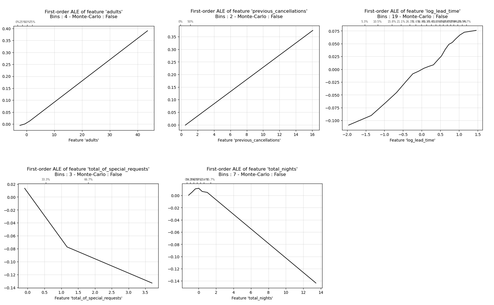
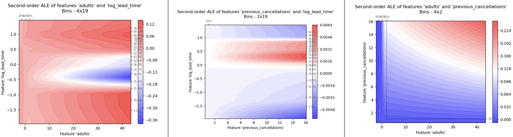
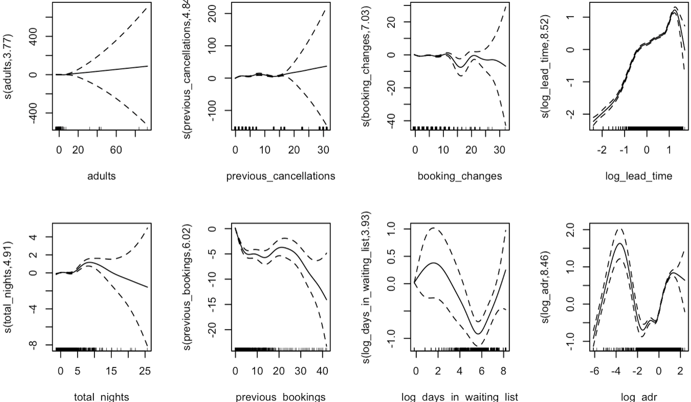
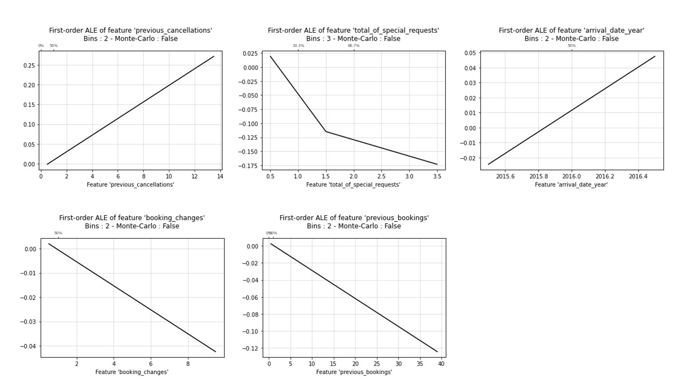
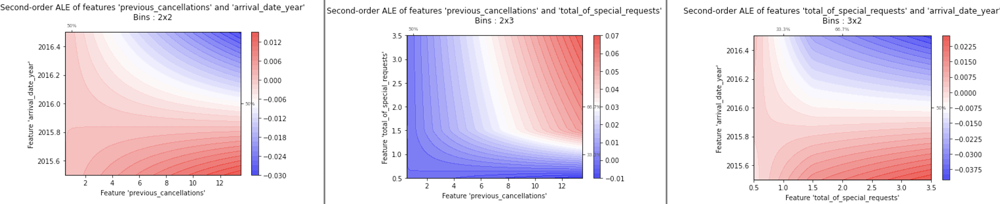
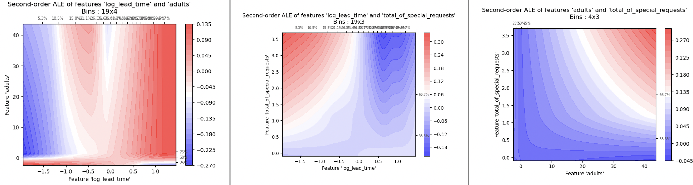

```{r setup, include=FALSE}
knitr::opts_chunk$set(echo = TRUE, warning = FALSE, message = FALSE)
```

# Introduction 

Smith Travel Research estimates there are 17.5 million guestrooms in 187,000 hotels worldwide. In 2020, global hotel revenue was $198.6 billion dollars, and the hotel and tourism industry accounts for approximately 10\% of worldwide GDP [@hoteltechreport]. The hotel industry experiences approximately 24\% of cancellations on reservations, and this rate increases up to 38\% for online bookings [@mkttips]. With these figures, and especially after the Covid-19 Pandemic, the study of hotel booking cancellations has become more relevant.

Accurately forecasting hotel booking cancellations and understanding the factors that influence such behavior is relevant for the following three reasons. First, from an economic perspective, each unoccupied room results in an monetary loss for the hotel. If accurately and timely forecasted, the hotel could still allocate the room to a different customer and avoid the loss of revenue. Additionally, an accurate prediction model could help the hotel to understand their net demand. Second, from the operational side of the business, managing cancellations is costly both in time and resources. For example, during peak seasons the hotel might need to allocate additional resources to manage cancellations and to try to reallocate the rooms. An accurate forecast could help to reduce operational costs and improve the hotel's efficiency. Third, from a marketing perspective, forecasting booking cancellations opens the possibility to implement pricing strategies, such as offering discounts to retain the customer.

Hotel booking cancellations and revenue management has been widely studied in literature. [@antonio2019big] use data from eight hotels combined with additional sources (such as weather or holidays) to develop booking cancellation prediction models to help hoteliers understand their net demand and improve their revenue management. [@chen2011search] use a multi-nomial logit regression model to analyze the impact of cancellation fees and deadlines on hotel bookings and find that the former affects customer's behavior but the latter doesn't. [@falk2018modelling] uses data from 9 hotels to estimate a probit model with cluster adjusted standard errors at the hotel level to find the determinants of cancellation probability, among which booking lead time and country of residence are the most important. [@sanchez2020using] apply ML algorithms to forecast hotel booking cancellations using genetic algorithms to configure the structural parameters of the artificial neural network used.

In this regard, we contribute to the study of hotel booking cancellations by analyzing the \textit{Hotel booking demand} data set available in [Kaggle](https://www.kaggle.com/datasets/jessemostipak/hotel-booking-demand)^[Data set retrieve on January 18th 2023 at https://www.kaggle.com/datasets/jessemostipak/hotel-booking-demand.] with the aim of forecasting hotel booking cancellations through the lens of Machine Learning (ML) models. This data set contains 119,390 booking records of a resort hotel and a city hotel from a chain in Portugal. It includes 32 predictors such as the date of the booking, length of stay, number of children and adults, type of meal, number of special requests, among others.  

To forecast cancellations, we first perform an exploratory data analysis to understand the data set and the relations between the predictors and the response. Then, we clean the data by selecting the main features and applying some transformations, as well as creating new features. Next, we fit several ML classification models to the final data set. For this process, we randomly split the data into training (95,511 observations) and test (23,877 observations). Specifically, we estimate a Naive Bayes classifier (benchmark), Logistic Regression, Neural Network, Tree, k-Nearest Neighbors, GAM, XGBoost, Random Forest, and Support Vector Machines. For each of these models, we use 10-fold cross-validation (CV) for hyperparameter tuning. Note that each model was run independently in this step. After finding the optimal hyperparameters, we apply 10-fold cross-validation again to compare the optimal models. Finally, we evaluate the model performance in the test set. To compare models, we use the misclassification rate, the AUC measure, and the F1-score.  

We find that the benchmark model (Naive Bayes) has an accuracy of 63\%, while the Logistic Regression (linear model) has better predictive power with an accuracy of 82.7\%. Nevertheless, the model that better fits the data is Random Forest, with an accuracy of 88.3\%, followed closely by Neural Network with 87\% accuracy. These results suggest that the data has some non-linearities that are better captured by "black-box" flexible models. Specifically, we believe that Random Forest performs better than Neural Network given its ability to deal with categorical data, which is abundant in our data set.  

The rest of the report is structured as follows. Section \ref{Sec:Data} presents the original data, exploratory data analysis, data cleaning and feature engineering strategy, and details the final data set to be used. Then, Section \ref{Sec:Modelling} succinctly presents each of the ML models selected to fit the data and the evaluation process. After this, Section \ref{Sec:Comparison} compares the forecasting power of each model. Lastly, Section \ref{Sec:Remarks} presents our final remarks.

\clearpage
# Data \label{Sec:Data}

## Original Data

Analyzing the \textit{Hotel booking demand} data set available in [Kaggle](https://www.kaggle.com/datasets/jessemostipak/hotel-booking-demand)The raw dataset comprises 32 columns and 119,390 rows, with 12 columns being categorical and the rest numerical. Each row represents a unique booking record, containing booking dates, length of stay, number of guests, booking platforms, meal plan types, and other information. Table \ref{tbl:DataDesc} details each variable in the dataset. 
\clearpage 

\begin{table}[ht]\label{tbl:DataDesc}
\centering
\caption{Data Description}
\begin{small}
\begin{tabularx}{\textwidth}{l|l|X}
\hline
\textbf{Variable}     & \textbf{Date Type}   & \textbf{Description} \\
\hline
ADR& \textit{Numeric}     & Average Daily Rate   \\
Adults                & \textit{Integer}     & Number of adults     \\
Agents                & \textit{Categorical} & ID of the travel agency that made the booking  \\
ArrivalDateDayOfMonth & \textit{Integer}     & Day of the month of the arrival date    \\
ArrivalDateMonth      & \textit{Categorical} & Month of arrival date with 12 categories: “January” to “December”  \\
ArrivalDateWeekNumber & \textit{Integer}     & Week number of the arrival date         \\
ArrivalDateYear  & \textit{Integer}     & Year of arrival date \\
AssignedRoomType & \textit{Categorical} & Code for the type of room assigned to the booking. Sometimes the assigned room type differs from the reserved room type due to hotel operation reasons (e.g. overbooking) or by customer request. Code is presented instead of designation for anonymity reasons \\
Babies                & \textit{Integer}     & Number of babies     \\
BookingChanges   & \textit{Integer}     & Number of changes/amendments made to the booking from the moment the booking was entered on the PMS until the moment of check-in or cancellation          \\
Children              & \textit{Integer}     & Number of children   \\
Company               & \textit{Categorical} & ID of the company/entity that made the booking or responsible for paying the booking. ID is presented instead of designation for anonymity reasons        \\
Country               & \textit{Categorical} & Country of origin. ISO 3155-3:2013 format  \\
CustomerType          & \textit{Categorical} & Type of booking, assuming one of four categories: Contract - when the booking has an allotment or other type of contract associated to it; Group – when the booking is associated to a group; Transient – when the booking is not part of a group or contract, and is not associated to other transient booking; Transient-party – when the booking is transient, but is associated to at least other transient booking   \\
DaysInWaitingList     & \textit{Integer}     & Number of days the booking was confirmed     \\
DepositType           & \textit{Categorical} & Indication on if the customer made a deposit to guarantee the booking. This variable can assume three categories: No Deposit; Non Refund; Refundable      \\
DistributionChannel   & \textit{Categorical} & Booking distribution channel. The term “TA” means “Travel Agents” and “TO” means “Tour Operators”  \\
IsCanceled            & \textit{Categorical} & Value indicating if the booking was BO canceled (1) or not (0)    \\
IsRepeatedGuest  & \textit{Categorical} & Value indicating if the booking name was from a repeated guest (1) or not (0) \\
LeadTime              & \textit{Integer}     & Number of days that elapsed between the entering date of the booking into the PMS and the arrival date  \\
MarketSegment         & \textit{Categorical} & Market segment designation. In categories, the term “TA” means “Travel Agents” and “TO” means “Tour Operators”      \\
Meal                  & \textit{Categorical} & Type of meal booked. Categories are presented in standard hospitality meal packages: Undefined/SC – no meal package; BB – Bed \& Breakfast; HB – Half board (breakfast and one other meal – usually dinner); FB – Full board (breakfast, lunch and dinner)  \\
PreviousBookingsNotCanceled              & \textit{Integer}     & Number of previous bookings not canceled by the customer prior to the current booking  \\
PreviousCancellations & \textit{Integer}     & Number of previous bookings that were canceled by the customer prior to the current booking      \\
RequiredCardParkingSpaces                & \textit{Integer}     & Number of car parking spaces required by the customer      \\
ReservationStatus     & \textit{Categorical} & Reservation last status, assuming one of three categories: Canceled – booking was canceled by the customer; Check-Out – customer has checked in but already departed; No-Show – customer did not check-in and did inform the hotel of the reason why     \\
ReservationStatusDate & \textit{Date}        & Date at which the last status was set. This variable can be used in conjunction with the ReservationStatus to understand when was the booking canceled or when did the customer checked-out of the hotel           \\
ReservedRoomType      & \textit{Categorical} & Code of room type reserved. Code is presented instead of designation for anonymity reasons       \\
StaysInWeekendNights  & \textit{Integer}     & Number of weekend nights (Saturday or Sunday) the guest stayed or booked to stay at the hotel    \\
StaysInWeekNights     & \textit{Integer}     & Number of week nights (Monday to Fri-day) the guest stayed or booked to stay at the hotel        \\
TotalOfSpecialRequests& \textit{Integer}     & Number of special requests made by the customer (e.g. twin bed or high floor) \\
\hline
\end{tabularx}
\end{small}
\end{table}
\clearpage 

To explore the data, we calculated descriptive statistics and created visualizations to illustrate the structure and distribution of our dataset. Four of the columns have missing values. The "children" column has four missing values, while the "country" column has 488 missing values. The "agent" column has 16,340 missing values, accounting for around 14\% of the total rows. The "company" column has 112,593 missing values, indicating that the majority of rows lack company information.

It is important to note that some categorical variables in the data have an excessively large number of classes or categories. One-hot encoding these variables would result in an unwieldy and expensive data set with a vast number of dimensions. Table \ref{tbl:CatVars} shows the number of categories in each variable.

\begin{table}[ht]
\caption{Number of Categories per Variable}
\label{tbl:CatVars}
\centering
\begin{tabular}{ll}
\hline
\textbf{Categorical Variable} & \textbf{\# of Categories} \\
\hline
arrival\_date\_month          & 12                        \\
assigned\_room\_type          & 12                        \\
country                       & 177                       \\
customer\_type                & 4                         \\
deposit\_type                 & 3                         \\
distribution\_channel         & 5 \\
hotel                         & 2 \\
market\_segment               & 8 \\
meal                          & 5                         \\
reservation\_status           & 3                         \\
reservation\_status\_date     & 926                       \\
reserved\_room\_type          & 10                       \\
\hline
\end{tabular}
\end{table}

## EDA 

Upon cleaning and one-hot encoding the raw data, we have the following findings: 

1. We didn’t find strong correlation between the variables (see Figure \ref{fig:CorrPlot}).

{width=75%}

2. The percentage of repeated guests that cancel reservations (17%) is considerably lower than the percentage of first-time customers that end up canceling the hotel booking (61%). 

3. For guests that opt for a non refundable booking, there is a surprisingly high proportion of cancellations in comparison to non cancellations. This phenomenon appears to challenge the notion that the absence of a refund would generally discourage cancellations. (See Table \ref{tbl:CatsPerVar})

\begin{table}[ht]
\caption{Number of Categories per Variable}
\centering
\label{tbl:CatsPerVar}
\begin{tabular}{llll}
\hline
\textbf{is\_canceled} & \textbf{No Deposit} &\textbf{Non Refund} & \textbf{Refundable} \\
\hline
0 & 74947 & 93 & 126\\
1 & 29694 & 14494 & 36 \\
\hline
\end{tabular}
\end{table}

4. A large majority of the guests are of Portuguese descent which matches general intuition considering the notion that the data reflect hotels based in Portugal. Furthermore, other common countries of origin are mostly from neighboring countries including the UK, France, and Spain (see Figure \ref{fig:country}).

{width=50%}


5. Individual and family stays constitute a large majority of the data; on the other hand, contract and group reservations appear to be far less prominent. (see Figure \ref{fig:CustomerType})

{width=50%}

\clearpage 

6. Bookings with a considerably large number of adults all appear to have been canceled. The graph also hints at potential outliers in the count of adults included in the reservation (see Figure \ref{fig:AdultsBoxplot}).

{width=55%}

7. The number of days a reservation is held in the waiting list is typically not too long and appears reasonable from a transactional standpoint. However, there are instances where the number of days a reservation was held in the waiting list prior to confirmation was considerably long (see Figure \ref{fig:daysWaiting})

{width=55%}

8. Aggregating the bookings by arrival date, a clear pattern of seasonality can be observed from the data: the demand for hotel bookings surges during the summers and winters (see Figure \ref{fig:arrivalDate} and Figure \ref{fig:arrivalMonth}).

\clearpage 

{width=50%}

{width=55%}

9. The duration of stays variables are highly right-skewed. From Table \ref{tbl:lengthStay} we can see that there are some bookings with very large outliers, while the majority of the stays last between 1 and 5 days. If we bin the columns, we observe roughly 46 rows with stays greater than 20 days.

\begin{table}[ht]
\caption{Length of stay in days.}
\label{tbl:lengthStay}
\centering
\begin{tabular}{ll}
\hline
\textbf{Class} & \textbf{Count}  \\
\hline
0-5 & 114537\\
6-10 & 4451\\
11-15 & 245\\
16.20 & 111\\
$>$20 & 46 \\
\hline
\end{tabular}
\end{table}

\clearpage 

10. There does not appear to be a meaningful difference in the mean number of stays and composition of guests between canceled and not canceled reservations (see Table \ref{tbl:GuestComp}).

\begin{table}[ht]
\caption{Number of stays in week days and guest composition.}
\centering
\label{tbl:GuestComp}
\begin{tabular}{l|l|lll}
\hline
\textbf{is\_canceled} & \textbf{Stays in week nights} & \textbf{Adults} & \textbf{Children} & \textbf{Babies}\\
\hline
0 & 2.4640 & 1.8297 & 0.1023 & 0.0103\\
1 & 2.5619 & 1.9017 & 0.1065 & 0.0038\\
\hline
\end{tabular}
\end{table}


## Data Cleaning, Transformations \& Feature Engineering 


<!--KIRAN'S-->

From our initial EDA, we have noticed a skewed distribution of the variable lead_time and hence we log transform it. The arrival month variable was converted to the corresponding month number instead of the month name. We also create a total_nights variable combining the number of nights a party had stayed on the weekends and weekdays, as it provided a more logical comparison among data points. 


\textcolor{red}{FINISH KIRAN}

<!--ELEN'S -->

<!--WENCHENG'S  -->

<!--ALE'S-->

## Final Data Set Description 

\textcolor{red}{KIRAN}


\clearpage
# Modelling\label{Sec:Modelling}

## Train, Test \& Cross Validation

To be able to build and test the predictive power of the different models, we randomly divided the data into train and test sets making sure to keep the proportion of cancellations in both of them. The train set has 95,511 observations and the test set has a total of 23,877 observations. Note that we store the indexes for each test, so that the model could be run independently with the training set while assuring that the same test set can be used for evaluating the different models. For each model, we use 10-fold cross validation to find the optimal hyperparameters (if needed). All the models are run in Python using the GridSearchCV method from the sklearn.model_selection module. The method iterates over the different combination of the chosen parameters, performs the cross validation and obtains the optimum combination based on the evaluation metrics. After this, we then retrain the optimal model using the entire training set and asses its predictive power using the test set. To assess the effectiveness of each model, we used accuracy, F-1 score, AUC score and ROC. 

\clearpage
## Naive Bayes (benchmark)

For the Naive Bayes model, we used the 'hotel_bookings_ohe.csv' file and standardized the data after splitting it into train and test sets. We conducted grid searches for hyperparameter tuning using 10-fold cross-validation. By optimizing the misclassification rate, we found that the best model had a var_smoothing value of 0.01.

Using the optimized set of hyperparameters, we fitted the model to the entire training set in 0.106 seconds, which was the fastest model among the 9 models we analyzed.

After fitting the best model, we generated ALE plots for all of the numerical predictors to interpret the variable importance of each one. Examining the ALE plots, we found that the top 5 most relevant numerical features are 'Previous_cancellations', 'total_of_special_requests', 'total_nights', 'booking_changes', and 'adults'.  

{width=80%}

The first-degree ALE plot shows that the effect of the predictor 'Previous_cancellations' is positive and linear, the effect of 'Total_nights' is negative and linear, the effect of 'total_of_special_requests' is negative and nonlinear, the effect of 'booking_changes' is negative and linear, and the effect of 'adults' is positive and linear.

{width=80%}

The second-degree ALE plots for the top 3 predictors showed that there are interaction effects between 'Previous_cancellations' and 'Total_nights', 'Total_nights' and 'total_of_special_requests', and 'Previous_cancellations' and 'total_of_special_requests'. These interaction effects indicate that the effects of 'Previous_cancellations', 'Total_nights', and 'total_of_special_requests' depend on each other. Specifically, the effect of 'Previous_cancellations' depends on 'Total_nights', the effect of 'Total_nights' depends on 'total_of_special_requests', and the effect of 'Previous_cancellations' depends on 'total_of_special_requests'.  

After retraining the model using the complete training dataset, we proceeded to make predictions on the unused test dataset. Upon inputting the standardized test data, we achieved a test accuracy of 63\% (equivalent to 37\%), a test F-1 score of 69\%, and a test AUC score of 68.8\%.

\clearpage
## Logistic Regression

As a first step, we fitted a logistic regression with regularization model to the "dummy" version of the data set (one less category for all categorical variables). We needed to remove the columns corresponding to *continent\_Antarctica* and *market\_segment\_unknown* since only two of these rows had a value equal 1, which was causing estimation problems. We chose to use regularization here given the large number of features. After standardizing the data, we use 10-fold CV to tune the hyperparameters of the model: the regularization parameter as well as the type of penalty L1 (Lasso) or L2(Ridge). The corresponding tunning values tried were: 

1. Regularization Parameter (*alpha*): 0.01, 0.1, 0.5, 1\footnote{The LogisticRegression function in Python uses the parameter $C$, the inverse of the regularization strength. This is $C = 1/alpha$.}

2. Penalty: L1, L2.

The best set of hyperparameters were $C= 10$ ($alpha = 0.1$) and $penalty = L2$ (Ridge Regression). 

After this, we retrained the model using the entire training set. The training took 105.13 seconds. Table \ref{tbl:LogisticResults} shows the estimated coefficients, standard error, t-values and p-values of the estimates. Most of the coefficients are very small (given the regularization) and appear to be statistically significant, except from *babies*, *previous_cancellations* and some categories of the categorical variables; however the last ones can not be removed from the model since the other categories are significant. It should be noted that, if any multicolinearity problems were present in the data, the Ridge regularization should have accounted for it.

\begin{table}[ht]
\label{tbl:LogisticResults}
\centering
\caption{Logistic Regression with Regularization}
\begin{tabular}{l|c|c|c|c}
\hline
\textbf{Variable} & \textbf{Coefficient} & \textbf{Std Error} & \textbf{t-Value} & \textbf{p-value} \\
\hline
intercept                       & 0.370580          & 0.001182          & 313.449680      & 0.000000e+00   \\

adults                          & 0.013047          & 0.001261          & 10.342817       & 0.000000e+00   \\
 
arrival\_date\_year             & 0.012114          & 0.001458          & 8.306857        & 2.220446e-16   \\
 
arrival\_month                  & 0.005266          & 0.001374          & 3.833599        & 1.263627e-04   \\
 
babies                          & 0.000621          & 0.001192          & 0.520899        & 6.024385e-01   \\
 
booked\_by\_agent               & 0.001589          & 0.001675          & 0.949059        & 3.425929e-01   \\
 
booked\_by\_company             & -0.010165         & 0.001868          & -5.440838       & 5.316028e-08   \\
 
booking\_changes                & -0.023985         & 0.001220          & -19.664697      & 0.000000e+00   \\
 
children                        & 0.011721          & 0.001221          & 9.599923        & 0.000000e+00   \\
 
continent\_Americas             & 0.129946          & 0.001431          & 90.825120       & 0.000000e+00   \\
 
continent\_Asia                 & 0.052032          & 0.001241          & 41.939896       & 0.000000e+00   \\
 
continent\_Europe               & -0.007459         & 0.001371          & -5.438615       & 5.382777e-08   \\
 
continent\_Oceania              & -0.002667         & 0.001353          & -1.970342       & 4.880212e-02   \\
 
continent\_unknown              & 0.019310          & 0.001451          & 13.305387       & 0.000000e+00   \\
 
customer\_type\_Group           & -0.003168         & 0.001230          & -2.575837       & 1.000127e-02   \\
 
customer\_type\_Transient       & 0.091732          & 0.001486          & 61.736363       & 0.000000e+00   \\
 
customer\_type\_Transient-Party & -0.007016         & 0.001534          & -4.572509       & 4.825215e-06   \\
 
deposit\_type\_Non Refund       & 0.022708          & 0.001443          & 15.739054       & 0.000000e+00   \\
 
deposit\_type\_Refundable       & -0.053722         & 0.001231          & -43.640793      & 0.000000e+00   \\
 
domestic                        & 0.013032          & 0.001318          & 9.887806        & 0.000000e+00   \\
 
got\_room\_booked               & -0.080558         & 0.001313          & -61.333992      & 0.000000e+00   \\
 
hotel                           & -0.008801         & 0.002086          & -4.218031       & 2.466721e-05   \\
 
is\_repeated\_guest             & -0.004408         & 0.001988          & -2.217690       & 2.657832e-02   \\
 
log\_adr                        & -0.029515         & 0.003002          & -9.833206       & 0.000000e+00   \\
 
log\_days\_in\_waiting\_list    & -0.007409         & 0.001277          & -5.800796       & 6.620843e-09   \\
 
log\_lead\_time                 & 0.007134          & 0.001289          & 5.533217        & 3.152325e-08   \\
 
market\_segment\_Complementary  & -0.002069         & 0.001226          & -1.687989       & 9.141667e-02   \\
 
market\_segment\_Corporate      & 0.027656          & 0.002527          & 10.944858       & 0.000000e+00   \\
 
market\_segment\_Direct         & -0.013570         & 0.002528          & -5.368508       & 7.957535e-08   \\
 
market\_segment\_Groups         & 0.122225          & 0.001662          & 73.558359       & 0.000000e+00   \\
 
market\_segment\_Offline TA/TO  & 0.000120          & 0.001194          & 0.100206        & 9.201812e-01   \\
 
market\_segment\_Online TA      & 0.003456          & 0.001505          & 2.295979        & 2.167921e-02   \\
 
meal\_FB                        & -0.008949         & 0.002790          & -3.207656       & 1.338657e-03   \\
 
meal\_HB                        & -0.022512         & 0.004224          & -5.329030       & 9.896198e-08   \\
 
meal\_SC                        & -0.005143         & 0.005713          & -0.900141       & 3.680473e-01   \\
 
meal\_Undefined                 & -0.040566         & 0.006315          & -6.423895       & 1.334526e-10   \\
 
previous\_bookings              & 0.052391          & 0.009169          & 5.713625        & 1.109223e-08   \\
 
previous\_cancellations         & 0.000503          & 0.001208          & 0.416528        & 6.770250e-01   \\
 
required\_car\_parking          & -0.004740         & 0.001260          & -3.762636       & 1.682321e-04   \\
 
total\_nights                   & 0.009229          & 0.001273          & 7.247466        & 4.278800e-13   \\
total\_of\_special\_requests    & -0.009105         & 0.001211          & -7.515931       & 5.706546e-14 \\
\hline
\end{tabular}
\end{table}

To assess the variable importance, we ploted the main effects for all numerical variables. Figure \ref{fig:mainEffectsLogistic} shows the main effects for the top 6 most important numerical variables based on the range of the y-axis (note that no main effects were plotted for categorical variables given the dummy version of the data set) which are number of previous cancellations (*previous\_cancellations*), lead time of booking (*log\_lead\_time*), number of adults (*adults*), total number of special requests (*total\_of\_special\_requests*), number of children (*children*) and total number of nights of stay (*total\_nights*). Most of the important variables show a linear effect on the cancellations, except for the lead time booking, which is not surprising giving that logisitc regression is a linear model, therefore would prioritize linear relations.Additionally, all the effects are positive except for number of special requests (i.e. the more requests, the less like like a customer is to cancel). 

{width=80%}

Figure \ref{fig:interactionsLogistic} shows the interaction (second order effects) for the top three numerical variables. As can be observed, there are some interactions between all of them, although the range of the effect in this plots is somewhat smaller than the range of the main effects plots. For example, higher number of previous cancellations has a higher effect on the response if there is a smaller lead time booking than if the room was booked with a lot of time in advance.

{width=80%}

Finally we used the test set to evaluate the model. Logistic regression with Ridge regularization reaches the following metrics: $miss-class\;rate = 0.173$, $accuracy = 0.827$, $F1\;score =0.74$ and $AUC = 0.90$. 

\clearpage
## Neural Networks

The MLPClassifier from the sklearn.neural\_network package was used to create the different neural network models. It creates a single layer perception with regularization.  Before fitting a neural network model, the numerical features were standardized, as the magnitude of the features could affect the final weights. The hyperparameters which we consider for tuning are the regularization parameter alpha, the learning rate and the number of hidden layer neurons.

The first set of values considered for the parameters are alpha = [0.0001,0.001,0.1], learning_rate = [0.001,0.01,0.1] and hidden_layer_size = [10,20,30]. On performing 5-fold cross validation, alpha=0.001,hidden_layer_size = 30 and learning_rate = 0.001 proved to be the best combination with a cross validation accuracy of 86.5\%. Analyzing the performance of different combinations, we have noticed that models with higher number of neurons performed better keeping the other parameters constant. The learning rate did not have a significant impact on determining the accuracy.

Hence we ran a second set of hyperparameters for tuning with alpha = [0.0001,0.001,0.1] and hidden_layer_size = [30,40,50]. Learning_rate was fixed at the value of 0.001. As expected, the optimum model had hidden_layer_size = 50 and alpha=0.001 with a cross validation accuracy of 86.8\%. Increasing the number of neurons thereafter did not showcase a significant improvement in accuracy. The final model was fit using the entire training data with a test accuracy of 87.2\%. and the ALE plots were constructed for the final model.

{width=50%}

Babies and log\_days\_in\_waiting\_list do not have a lot of distinct values and is mostly dominated by a single value which is 0. So they do not produce an ALE plot. Children,arrival\_date\_year,booking\_changes and total\_nights do not seem to have a significant effect on the target based on the range of values present on the ALE plot values. 

The top 5 features which influence the values are as follows 

1) previous\_cancellations 
2) log\_lead\_time 
3) log\_adr 
4) adults  
5) previous\_bookings

Considering the top 5 features, previous\_cancellations,log\_adr and previous\_bookings have a linear effect on the outcome. previous\_cancellations have an increasing effect on the probability of cancellations while adults and previous\_bookings have a decreasing effect on the probability. log\_lead\_time and log\_adr have a non-linear increasing effect on the probability. The effect of log\_adr almost seems quadratic.

We can infer that maybe someone who has cancelled a lot previously have a higher probability to cancel again. A booking with a higher lead time could also have a higher probability of cancelling as there is a higher chance of their plans to change due to a large window of time between booking and arrival.

We can also check for interactions using the 2 variable ALE plots

{width=50%}

Based on the ranges of values in the interaction plots, we can conclude that a significant interaction effect is not present among previous\_cancellation and log\_lead_time and between previous\_cancellations and log\_adr. There is a noticeable interaction effect between log\_adr and log\_lead_time. For a fixed value of log\_adr, the probability of cancelling decreases with increasing value of log\_lead_time. This effect is more pronounced at high values of log\_adr compared to low values.


\clearpage
## Tree 

For the Decision Tree model, we utilized the 'hotel_bookings_ohe.csv' dataset. As decision tree models are not sensitive to the scale of the data, we did not standardize it. Through 10-fold cross-validation, we tuned the hyperparameters 'ccp_alpha' and 'max_depth' using 'criterion' as 'entropy' and found the optimal values to be 0.001 and 15, respectively. We then fit the best decision tree model to the entire training set.  

{width=80%} 

To interpret the best model, we looked at the top 5 most important variables, which were 'deposit_type_Non_Refund', 'market_segment_Online TA', 'domestic', 'required_car_parking 1', and 'total_of_special_requests'. We visualized the importance of these variables through a decision tree variable importance plot and analyzed the Average Local Effects (ALE) plot and second-degree ALE plot for the top 5 numerical predictors.

{width=80%}

The first-degree ALE plots indicated that the effect of 'total_of_special_requests' is negative and non-linear, the effect of 'log_lead_time' is negative and non-linear, the effect of 'arrival_date_year' is positive and linear, the effect of 'previous_cancellations' is positive and linear, and the effect of 'log_adr' is positive and non-linear.

{width=80%}

The second-degree ALE plots for 'log_lead_time', 'arrival_date_year', and 'total_of_special_requests' revealed significant interaction effects among them, indicating that the effect of each variable on the cancellation probability depends on one another.

Using the test dataset, we made predictions and calculated the performance metrics for our decision tree model. The results showed an accuracy of 84\%, an F-1 score of 77\%, and an AUC score of 81.9\%.


\clearpage
## Nearest Neighboors

The dataset "hotel_bookings_dummy" was used for the K-Nearest Neighbor model, and we standardized the data. To determine the optimal value of k, we performed 5-fold cross-validation on the training data. A grid search was conducted on values of k ranging from 1 to 40, and the KNN model achieved the highest cross-validation accuracy (lowest misclassification rate) with k = 6.

{width=80%}

Once we determined the optimal value of k, we proceeded to find the six nearest neighbors in the training set for each row in the test set predictors. We then calculated the predicted class for the test set. Since KNN is a truly non-parametric method, there was no model to train. We timed the process of predicting the class label for the test set and noted the duration.

From analyzing the ALE plots, see Figure \ref{fig:knnALE1}, we identified the five most important numeric variables as the number of adults, previous cancellations, lead time, number of special requests, and number of nights staying at the hotel. The predictor "adults" had a positive linear effect, "previous_cancellations" had a positive linear effect, "log_lead_time" had an almost linear and positive effect, "total_of_special_requests" had a non-linear and negative effect, and "total_nights" had a non-linear and somewhat quadratic effect (positive at first, then negative).

{width=80%}  

Next Figure \ref{fig:interactionKNN} shows the generated second-degree ALE plots for the top three most relevant numerical variables. These plots showed that the effect of 'adults' was dependent on 'previous\_cancellations' and 'log\_lead\_time', while the effect of 'log\_lead\_time' was also dependent on 'previous_cancellations'. Please refer to the inserted second-degree ALE plots for more details.

{width=80%}

After comparing the predicted cancellation label class with the actual label in the test set, we found that the best KNN model with k = 6 achieved an accuracy of 86.1\%, an AUC score of 83.8\%, and an F-1 score of 80.0\%.


\clearpage
## GAM

Before we try fitting a GAM model, we have to convert all categorical variables into factors. The variables children, babies and market segment had too many factors due to which the GAM model was not able to fit the data on cross validation and test data set. Hence they were not considered for our analysis. The feature arrival\_date\_year even though should be considered as a continuous variable, it could not be introduced as one due to less number of distinct values in the data. Hence it was also not considered in the GAM model. The variables adults, previous\_cancellations, booking\_changes, log\_lead\_time, total\_nights, previous_bookings, log\_days\_in\_waiting\_list and log\_adr are to treated as smoothed features in the GAM model. The feature values were standardized before introducing the data set into the model.

The results from the initial model are  as follows:

Parametric coefficients:
\begin{table}{h}
\centering
\caption{GAM Model Estimated Coefficients}
\begin{tabular}{l|c|c|c|c}
\hline
Variable & Estimate & Std. Error & z value & $Pr(>|z|)$\\
\hline
(Intercept)                 & -3.323e-01 & 1.544e-01 & -2.153 &0.031353 *  \\
hotelResort Hotel           &  1.730e-01 & 2.722e-02 &  6.358 &2.05e-10 ***\\
mealFB                      & -4.573e-01 & 1.301e-01  &-3.514& 0.000441 ***\\
mealHB                      & -4.730e-01 & 3.236e-02 &-14.616 & < 2e-16 ***\\
mealSC                      &  6.172e-01 & 3.012e-02  &20.490&  < 2e-16 ***\\
mealUndefined               & -1.351e+00 & 1.244e-01 &-10.856 & < 2e-16 ***\\
is\_repeated\_guest1          & -7.670e-01 & 1.385e-01 & -5.538& 3.06e-08 ***\\
deposit\_typeNon Refund       & 4.016e+00 & 1.292e-01 & 31.077 & < 2e-16 ***\\
deposit\_typeRefundable      &  3.694e-01&  2.703e-01  & 1.367& 0.171720    \\
customer\_typeGroup          & -4.575e-02 &2.251e-01&  -0.203 &0.838936    \\
customer\_typeTransient      &  1.348e+00 & 7.062e-02 & 19.088 & < 2e-16 ***\\
customer\_typeTransient-Party  & 1.571e-01 & 7.416e-02 &  2.118& 0.034151 *  \\
total\_of\_special\_requests1  & -1.029e+00 & 2.213e-02 &-46.491 & < 2e-16 ***\\
total\_of\_special\_requests2 &  -1.094e+00 & 3.100e-02& -35.285 & < 2e-16 ***\\
total\_of\_special\_requests3  & -1.429e+00 & 6.856e-02& -20.847 & < 2e-16 ***\\
total\_of\_special\_requests4 &  -2.217e+00 & 2.180e-01 &-10.170 & < 2e-16 ***\\
total\_of\_special\_requests5 &  -3.261e+00 & 1.059e+00&  -3.078 &0.002081 ** \\
arrival\_month2             &  -4.257e-02 & 5.803e-02 & -0.733& 0.463260    \\
arrival\_month3             &  -4.097e-01 &  5.662e-02 & -7.235 &4.64e-13 ***\\
arrival\_month4             &  -4.117e-01 & 5.626e-02 & -7.317 &2.53e-13 ***\\
arrival\_month5             &  -6.620e-01 & 5.662e-02 &-11.691 & < 2e-16 ***\\
arrival\_month6             &  -8.053e-01 & 5.785e-02& -13.919 & < 2e-16 ***\\
arrival\_month7             &  -9.894e-01 & 5.728e-02& -17.274 & < 2e-16 ***\\
arrival\_month8             &  -7.780e-01 & 5.743e-02 &-13.549 & < 2e-16 ***\\
arrival\_month9             &  -9.034e-01 &  5.988e-02& -15.087 & < 2e-16 ***\\
arrival\_month10            &  -5.542e-01 & 5.760e-02 & -9.621 & < 2e-16 ***\\
arrival\_month11            &  -3.231e-01 & 6.165e-02 & -5.241 &1.60e-07 ***\\
arrival\_month12            &  -2.016e-01 & 6.142e-02 & -3.282 &0.001030 ** \\
domesticinternational      &  -1.827e+00 & 2.425e-02 &-75.326 & < 2e-16 ***\\
continentAmericas          &  -1.007e+00 & 9.638e-02 &-10.451 & < 2e-16 ***\\
continentAntarctica        &  -9.882e+01 & 6.711e+07 &  0.000& 0.999999    \\
continentAsia              &  -8.092e-01 & 9.681e-02 & -8.358 & < 2e-16 ***\\
continentEurope            &  -1.477e+00 & 8.873e-02& -16.646 & < 2e-16 ***\\
continentOceania           &  -1.518e+00 & 1.584e-01 & -9.583 & < 2e-16 ***\\
continentunknown           &  -6.388e-01 & 2.834e-01 & -2.254 &0.024183 *  \\
got\_room\_booked1           &   1.854e+00 &4.669e-02 &39.711 & < 2e-16 ***\\
booked\_by\_agentyes         &   4.129e-01 & 4.517e-02 v  9.141 & < 2e-16 ***\\
booked\_by\_company1         &  -2.063e-01 & 7.064e-02 & -2.920 &0.003501 ** \\
required\_car\_parking1      &  -8.766e+01 & 8.697e+05 &  0.000 &0.999920    \\
\hline
\end{tabular}
\end{table}

We can notice that at least one variables related to any categorical feature is significant except for required\_car\_parking. We could try removing it from the data set. We obtain the following set of coefficients.


\begin{table}{h}
\centering
\caption{GAM Model Estimated Coefficients}
\begin{tabular}{lcccc}
\hline
Variable & Estimate & Std. Error & z value & $Pr(>|z|)$\\
\hline
(Intercept)                  &-4.988e-01  & 1.529e-01 & -3.263 & 0.00110 ** \\
hotelResort Hotel            &-6.275e-02  & 2.602e-02 & -2.412 &  0.01588 *  \\
mealFB                       &-4.798e-01  & 1.225e-01 & -3.917 & 8.98e-05 ***\\
mealHB                       &-4.211e-01  & 3.133e-02 &-13.438 &  < 2e-16 ***\\
mealSC                      &  6.162e-01  & 2.979e-02 & 20.689  & < 2e-16 ***\\
mealUndefined               & -1.157e+00  & 1.217e-01 & -9.504  & < 2e-16 ***\\
is\_repeated\_guest1          & -7.999e-01  & 1.360e-01 & -5.882 & 4.05e-09 ***\\
deposit\_typeNon Refund      &  4.125e+00  & 1.285e-01 & 32.110  & < 2e-16 ***\\
deposit\_typeRefundable      &  4.622e-01  & 2.647e-01 &  1.746  & 0.08081 .  \\
customer\_typeGroup          & -3.991e-02  & 2.214e-01 & -0.180  & 0.85690    \\
customer\_typeTransient      &  1.273e+00  & 6.986e-02 & 18.225  & < 2e-16 ***\\
customer\_typeTransient-Party&  1.616e-01  & 7.338e-02 &  2.202  & 0.02765 *  \\
total\_of\_special\_requests1  & -1.017e+00  & 2.158e-02 &-47.140  &< 2e-16 ***\\
total\_of\_special\_requests2  & -1.081e+00  & 3.023e-02 &-35.755  & < 2e-16 ***\\
total\_of\_special\_requests3  & -1.422e+00  & 6.696e-02 &-21.237  & < 2e-16 ***\\
total\_of\_special\_requests4  & -2.184e+00  & 2.154e-01 &-10.137  & < 2e-16 ***\\
total\_of\_special\_requests5  & -3.130e+00  & 1.045e+00 & -2.995  & 0.00274 ** \\
arrival\_month2              & -9.557e-03  & 5.699e-02 & -0.168  & 0.86682    \\
arrival\_month3              & -3.811e-01  & 5.561e-02 & -6.853 & 7.24e-12 ***\\
arrival\_month4              & -3.539e-01  & 5.511e-02 & -6.421 & 1.35e-10 ***\\
arrival\_month5              & -5.695e-01  & 5.548e-02 &-10.263  & < 2e-16 ***\\
arrival\_month6              & -7.421e-01  & 5.662e-02 &-13.106  & < 2e-16 ***\\
arrival\_month7              & -9.265e-01  & 5.604e-02 &-16.534  &< 2e-16 ***\\
arrival\_month8              & -7.100e-01  & 5.613e-02 &-12.650  &< 2e-16 ***\\
arrival\_month9              & -8.481e-01  & 5.866e-02 &-14.457  &< 2e-16 ***\\
arrival\_month10             & -5.013e-01  & 5.653e-02 & -8.868  &< 2e-16 ***\\
arrival\_month11             & -2.897e-01  & 6.060e-02 & -4.780 &1.76e-06 ***\\
arrival\_month12             & -1.885e-01  & 6.013e-02 & -3.135  &0.00172 ** \\
domesticinternational       & -1.730e+00  & 2.331e-02 &-74.221  &< 2e-16 ***\\
continentAmericas           & -1.011e+00  & 9.444e-02 &-10.708  &< 2e-16 ***\\
continentAntarctica         & -6.867e+01  & 6.711e+07 &  0.000  &1.00000    \\
continentAsia               & -7.946e-01  & 9.488e-02 & -8.374  &< 2e-16 ***\\
continentEurope             & -1.461e+00  & 8.694e-02 &-16.807  &< 2e-16 ***\\
continentOceania            & -1.503e+00  & 1.562e-01 & -9.626  &< 2e-16 ***\\
continentunknown            & -8.270e-01  & 2.702e-01 & -3.061  &0.00220 ** \\
got\_room\_booked1            &  1.865e+00  & 4.615e-02 & 40.413  &< 2e-16 ***\\
booked\_by\_agentyes          &  4.684e-01  & 4.374e-02 & 10.708  &< 2e-16 ***\\
booked\_by\_company1          & -1.495e-01  & 6.925e-02 & -2.158  &0.03089 *\\
\hline
\end{tabular}
\end{table}

We achieve a test set accuracy of 81.3\% using this model. We can examine the component graphs of the obtained GAM model.

{width=80%}

The component graphs showcases some interesting insights. The effect of adults on the probability of cancellation is almost constant but the confidence interval of the effect gets wider as the number of adults increases. This implies the effect of adults is ambiguous. The same can be observed for the predictor previous_cancellations. A periodic pattern is also revealed on the impact of predictors such as booking_changes, previous_bookings, and log_adr on the probability of cancellation, where high values of these predictors alternate between increasing and decreasing the probability of cancellation at regular intervals.log_lead_time reveals to have a constant increasing effect on the cancellation probability. A increase in total_nights seem to showcase a decreasing trend at higher values but we have less number of points at that range to come to a conclusion.

\clearpage
## Boosting (XGBoost)

For the XGBoost model, we used the 'hotel_bookings_ohe.csv' dataset. 
As XGBoost is a decision tree-based model, we did not standardize the data. Through 10-fold cross-validation, we tuned the hyperparameters 'learning_rate', 'max_depth', and 'n_estimators' and found the best values to be 0.1, 7, and 200 respectively.  
We then fit the best model to the entire training set and interpreted it using the variable importance measures built-in to the model.  

{width=80%}

The top 5 variables are 'deposit_type_Non_Refund', 'required_car_parking 1", 'market_segment_Online TA', 'previous_cancellations' and 'domestic'. We visualized the importance of these variables through a variable importance plot and analyzed the Average Local Effects (ALE) plot and second-degree ALE plot for the numerical predictors.  

{width=80%}

The first-degree ALE plot shows that the effect of the predictor 'Previous_cancellations' is positive and linear, the effect of 'total_of_special_requests' is negative and nonlinear, the effect of 'booking_changes' is negative and linear, and the effect of 'arrival_date_year' is positive and linear.

{width=80%}

Upon examining the second degree ALE plots, we discovered interaction effects between 'previous_cancellations', 'arrival_date_year', and 'total_of_special_requests'. These predictors' effects on the cancellation probability are interdependent and rely on each other.

Using the test dataset, we made predictions and calculated the performance metrics for our model. The results showed an accuracy of 87\%, an F-1 score of 82\%, and an AUC score of 85.7\%. 


\clearpage
## Random Forest

We used the RandomForestClassifier function from the sklearn.ensemble package in Python to fit a classification Random Forest. For this model, the one-hot-encoding version of the data set was used (Random Forest does not need standardized data). First, we use 10-fold CV to tune the hyperparameters of the model. The parameters tuned and the corresponding values tried were: 

1. Number of trees (*n\_estimators*): 50, 100, 150, 200, 250, 500, 1000

2. Minimum number of samples in a leaf node (*min\_samples\_leaf*): 2,3,4,5

3. Number of features to consider for spliting (*max\_features*): 1, 2, 3, 4, 5

The best set of hyperparameters were $*n\_estimators* = 1,000$, $*min\_samples\_leaf* = 2$ and $*max\_features*=5$. 

After this, we retrained the model using the entire training set. The training took 19.53 seconds. As for the variable importance, \ref{fig:varImpRF} shows 20 most imortant features. Among those, the leading time of booking (*log\_lead\_time*), the type of deposit (*deposit\_type*), the average daily rate (*log\_adr*), the total number of requests (*total\_of\_special\_requests*) and if it is a domestic customer (*domestic*) stand out. 

{width=80%}

Figure \ref{fig:mainEffectsRF} shows the main effects for the top 6 most important numerical variables (note that no main effects were plotted for categorical variables given the ohe version of the data set). For the leading time of booking, the average daily price, the total number of special requests and total number of nights the effect is non-linear and it increases as the value of the variable increases, except for number of special requests. Additionally, we can observe that the number of previous cancellations and the arrival date year have a linear positive effect in the response. This result is intuitive for the number of previous cancellations, if you normally cancel, there is a high chance that you will cancel again. 

{width=80%}

Figure \ref{fig:interactionsRF} shows the interaction (second order effects) for the top three variables. As can be observed, there are strong interactions between all of them. For example, higher values of lead time (booked with many time in advanced) at a small average daily rate has a higher impact on cancellations, while higher values of lead time but with higher average daily rate has a lower impact on cancellations. Similarly, a higher number of special requests has a different impact on cancellations depending on the lead time of booking and the average daily rate. 

{width=80%}

Finally we used the test set to evaluate the model. Random Forest reaches the following metrics:  $miss-class\;rate = 0.1173$, $accuracy = 0.8827$, $F1\;score =0.8320$ and $AUC = 0.95$. 


\clearpage
## Support Vector Machines

We used the data set "hotel_bookings_dummy" for the SVM model. Similar to KNN, we employed 10-fold cross-validation to tune the hyperparameters C, kernel type, gamma, and class_weight. Through cross-validation, we determined that the best set of parameters were {'C': 0.1, 'class_weight': None, 'gamma': 0.1, 'kernel': 'rbf'}.

Using the above hyperparameters, we trained the SVM model with the entire training data set. The training process was computationally intensive, taking 59 seconds to complete.

To evaluate the importance of the numerical predictors, we generated first-degree ALE plots for each of them in Figure \ref{fig:ALE1SVM}. The plots revealed that the most important numerical predictors were 'log\_lead\_time', 'total\_of_special\_requests', 'adults', 'total\_nights', and 'log\_adr'.

{width=80%}

The variable "log\_lead\_time" exhibited a positive, nearly linear effect, while "total\_of\_special\_requests" displayed a negative, linear effect. "Adults" had a non-linear, quadratic effect that was initially negative before becoming positive, "total\_nights" had a positive, almost-linear effect, and "log\_adr" had a somewhat quadratic, non-linear effect that was initially positive before becoming negative.

{width=80%}

According to the second degree ALE plot,see Figure \ref{fig:ALE2SVM}, the impact of 'log\_lead\_time' varied depending on the values of 'adults' and 'total\_of\_special\_requests'. Additionally, the effect of 'adults' was also dependent on the values of 'total\_of\_special\_requests'.

In the end, we found that the best SVM model achieved a test accuracy of 56.4\%, and an AUC score of 63.5\%, and an F-1 score of 60.6\%, making SVM the worst performing model in the entire exercise.


\clearpage
# Model Comparison\label{Sec:Comparison}

\begin{table}[!ht]
    \centering
    \caption{Model Comparison for Test Set}
    \label{tbl:comparisonMods}
    \begin{tabularx}{\textwidth}{l|c|c|c|c|c|X}
    \hline
        Model & Accuracy & Missclass & F-1  & AUC & Training  & Top 5 Important  \\ 
            &  &  & Score & AUC & Time (s) & Features \\ 
    \hline
        Random Forest & 0.883 & 0.117 & 0.832 & 0.950 & 19.5 & log lead time, log adr,total of special requests, total nights, previous cancellations\\ \hline
        Neural Network & 0.872 & 0.128 & 0.824 & 0.859 & 60.9 & previous cancellations, log lead time, log adr, adults, previous bookings\\ \hline
        XGBoost & 0.870 & 0.130 & 0.820 & 0.857 & 6.0 & Deposit type non refund, required car parking, market segment online, previous cancellations, domestic\\ \hline
        KNN & 0.861 & 0.139 & 0.800 & 0.838 & 3.6 & adults, previous cancellations, log lead time, number of special requests, number nights\\ \hline
        Decision Tree & 0.840 & 0.160 & 0.770 & 0.819 & 0.5 & Deposit type non refund, market segment online, domestic, required car parking, total of special requests\\ \hline
        Logistic Regression & 0.827 & 0.173 & 0.746 & 0.900 & 150.1 & previous cancellations, log lead time, adults, total of special requests, children, total nights\\ \hline
        GAM & 0.813 & 0.187 & 0.719 & 0.779 & 297.6 & previous bookings, log lead time, log adr, total nights, log days in waiting list\\ \hline
        Naive Bayes & 0.630 & 0.370 & 0.690 & 0.688 & 0.1 & previous cancellations, total of special requests, total nights, booking changes, log adr\\ \hline
        SVM & 0.564 & 0.436 & 0.606 & 0.635 & 59.4 & log lead time, total of special requests, adults, total nights, log adr\\ 
    \hline
    \end{tabularx}
\end{table}

Table \ref{tbl:comparisonMods} shows the wide range of performance for the 9 models fitted. Random Forest was the best performing model, with a test accuracy of 88.3\%, followed closely by Neural Network and XGBoost, which achieved prediction test accuracy of over 87\% each. These results were expected since the data set contained a large number of categorical variables, and tree-based models like Random Forest were better equipped to handle them. SVM was the worst performing model, as expected, and Naive Bayes also suffered in prediction accuracy, but its test accuracy was 6.5 percentage points higher than the SVM model.  

Although class imbalance was not a huge issue, with roughly 36\% of the label class being 1, the ROC AUC metric showed that the runner-up to Random Forest was actually the logistic regression model. Another dimension to consider was the computational expense of the models, indicated by the training time. Our results table revealed that the training time values varied dramatically. Naive Bayes and Decision Tree models took less than a second to train, while logistic regression took 150 seconds. Among the top performers, Random Forest took roughly 19 seconds to train, which was relatively fast, and XGBoost was even faster, delivering a test accuracy of 87\% in less than 6 seconds. On the other hand, SVM was the worst performing model, taking almost 60 seconds to train, which exhibited an incredibly low ROI.

\begin{table}[h]
\caption{Most Important Features Accross Methods}
\centering
\label{tbl:FeatureImportanceSummary}
\begin{tabular}{lc}
\hline
\textbf{Feature}             & \textbf{No. Appearences} \\
\hline
log\_lead\_time              & 6                        \\
total\_of\_special\_requests & 6                        \\
log\_adr                     & 5                        \\
total\_nights                & 5                        \\
previous\_cancellations      & 5                        \\
adults                       & 4                        \\
previous\_bookings           & 2                        \\
deposit\_type                & 2                        \\
required\_car\_parking       & 2                        \\
market\_segment              & 2                        \\
domestic                     & 2                        \\
children                     & 1                        \\
days\_in\_wait\_list         & 1                        \\
number\_booking\_changes     & 1                       \\
\hline
\end{tabular}
\end{table}

Table \ref{tbl:FeatureImportanceSummary} showes the number of times each variable was a top 5 important feature in each model. Note however that, for some algorithms without a built in method of importance, categorical features that are important might not show up, given the ALE plots used in the analysis do not plot anything for categorical variables. With that on mind, the common most important features for the booking cancellations data are the lead time of each booking, the total number of special requests, average daily rate, number of previous cancellations and number of adults. 

# Final Remarks\label{Sec:Remarks}

Through this project we applied supervised models to study hotel booking cancellations. First, we did an exploratory data analysis, cleaned and transform the predictors and created three different versions of our data set: *clean* (numerical and categorical variables), *dummy* (numerical, each categorical feature with k categories is represented with k-1 dummy variables) and *ohe* (numerical, each categorical feature with k categories is represented with k dummy variables). Each model uses a specific version of the data depending on its requirements and characteristics, and the data sets were randomly spitted in train and test. We then estimated nine supervised models to predict hotel booking, using Naive Bayes as our benchmark. Specifically, we estimated Naive Bayes classifier, Logistic Regression, Neural Network, Tree, k-Nearest Neighboors, GAM, XGBoost, Random Forest and Support Vector Machines as our additional model not studied in class. We trained every model using 10-fold CV for the training data, and then asses the predictive power of the models with the test set using miss-classification rate, accuracy, F1 Score and AUC as our metrics. We find that the model that best fits the data is Random Forest with a test accuracy of 88.3\%, followed closely by Neural Network and XGBoost, which achieved prediction test accuracy of over 87\% each. It is worth noting that, from these three models, XGBoost has the fastest training, being 10 times faster than Neural Networks and 3 times faster than Random Forest. This might be relevant to consider from a business perspective given that, in production, the hotel might need to get accurate predictions daily and retrain the model every week, if not at a higher frequency, for all the hotels in the chain. Thus, the trade-off of reducing accuracy by 0.013 against reducing the training to one third of the time is worth it and will have a great impact in the hotel management and resource allocation that will finally be translated into more profit for the hotel. 

# References